# Hello there, I'm Zoltan 'Tavstal' Solymosi!

I'm a passionate self-taught programmer from Hungary with a strong focus on C# and the .NET ecosystem. I specialize in backend development, building APIs, services, and logic-heavy applications, but I also enjoy working across the full stack when needed. I'm dedicated to writing clean, maintainable code, and always eager to learn and improve.

---

## About Me

- Backend developer with expertise in **C#**, **.NET / .NET Framework**, and **ASP.NET**
- Full-stack capable with experience in **React.js** and modern web technologies
- I develop libraries, console tools, desktop apps, and web applications
- Game plugin/modding enthusiast (Minecraft, Unturned, Unity)
- Always learning and open to exploring new technologies

---

## Tech Stack

| Area             | Tools & Technologies                                                                                  |
|------------------|--------------------------------------------------------------------------------------------------------|
| Languages      | `C#` `Java` `JavaScript` `Basic Python` `Basic Bash` `Basic TypeScript`                               |
| Backend        | `.NET 6` `.NET 9` `.NET Framework` `ASP.NET` `Basic Node.js`                                           |
| Databases      | `MySQL` `MariaDB` `Some PostgreSQL`                                                                   |
| Frontend       | `HTML` `Basic CSS` `Tailwind CSS` `React.js`                                                          |
| Game Dev       | `Unity (modding)` `Unreal Engine 4 (Blueprint)`                                                       |
| Plugin/Modding | `Unturned RocketMod` `Minecraft Spigot/Paper` `Minecraft Forge/Fabric`                                |
| Tools & DevOps | `Git` `Docker` `Nginx` `Postman` `Portainer` `Jenkins`                                                 |
| IDEs & Tools   | `JetBrains Rider` `Visual Studio` `VSCodium` `IntelliJ` `DBeaver` `VirtualBox` `Cisco Packet Tracer`                 |
| Operating Sys. | `Windows 11` `Arch Linux (DE: KDE)`  

---

## GitHub Stats

<!--  -->

---

## Connect with Me

- 
- 

---

## Support My Work

If you like what I do, consider buying me a coffee:

---

> I'm always open to collaboration, learning opportunities, and challenging projects. Feel free to reach out!
